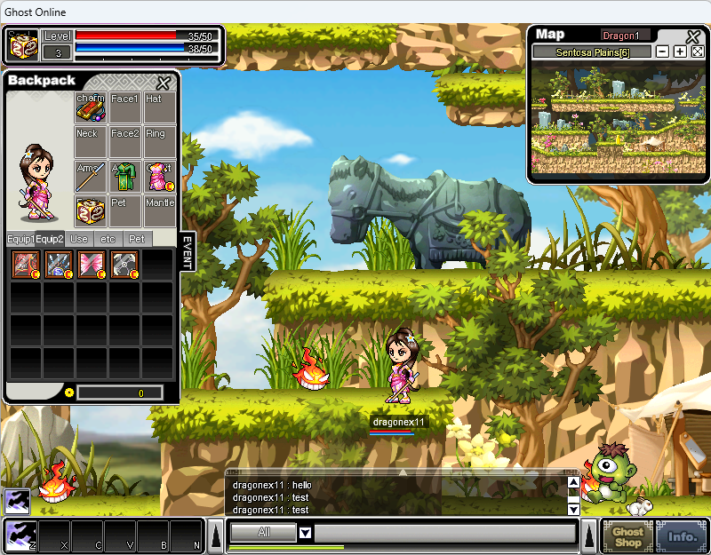

# Ghost Online Private Server

Ghost Online emulator built on Classic Ghost Online (Malaysian version). This is an experimental project for educational purposes — use at your own risk.



## What's working

**Working**
- ✅ Auth / auto-register
- ✅ Character select / create / delete
- ✅ Maps, movement, combat
- ✅ Drops, shops, cash shop
- ✅ Quests, fishing
- ✅ Merchant shops (free market)
- ✅ Friend list, party, mail
- ✅ Monster AI / respawn / aggro

**Not working**
- ❌ Guild
- ❌ Alliance
- ❌ Chat room
- ❌ PVP
- ❌ Better mob system
- ❌ PQS
- ❌ More…

## Architecture

The process opens several sockets the game client talks to in sequence:

| Server | Protocol | Port | Role |
|--------|----------|------|------|
| Login | TCP | 15001 | Account login |
| Channel | TCP | 15013 | Character select |
| Field | TCP | 15023 | In-game world |
| Field | UDP | 13997 | In-game world (UDP) |
| Messenger | TCP | 17201 (alt 13070) | Social / messaging |

## Requirements

- Node.js 20+
- MySQL 5.7+ / 8.x or MariaDB

## Quick start

```bash
cp .env.example .env
# edit .env → set DATABASE_URL

mysql -u USER -p -e "CREATE DATABASE IF NOT EXISTS ghostonline CHARACTER SET latin1;"
mysql -u USER -p ghostonline < database/schema.sql

npm install
npm start
```

`database/schema.sql` is the **only** database file you need. It creates all tables and seeds:

- GM account
- Monster spawns
- Cash shop catalog
- Monster drop rules
- NPC item prices

### Default GM account

| Field | Value |
|-------|--------|
| Username | `admin` |
| Password | `admin` |
| GM | yes |

Create a character in-game after logging in.

## Configuration

| Item | Details |
|------|---------|
| `.env` | Copy from `.env.example`. Required: `DATABASE_URL`. |
| `rates.json` | Rates + optional `.env` overrides. |
| `data/map_pexels/` | Map collision / height |
| `data/client/table/item.itm` | Item ID validation |
| `data/client/data/OBJ/PET/` | Pet sprite checks |
| `data/client/data/Project/` | Map existence checks |

## Project layout

```
src/                 # login / channel / field / messenger
database/schema.sql  # single MySQL schema + all game seed data
data/                # map_pexels + minimal client assets
rates.json
.env.example
```

## Notes

- Unknown usernames auto-register on login.
- `data/client/` holds proprietary game assets required for server-side validation. Redistribute only if you have the rights to do so.
